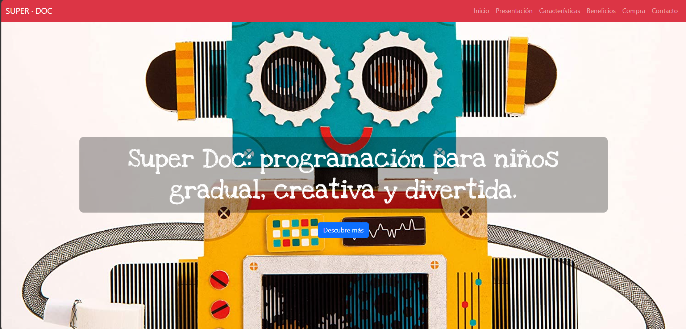

# 🤖 Super Doc - One-Page Site Responsive para Robot Educativo

¡Bienvenido/a a este proyecto de Maquetación y Diseño Web! En este repositorio comparto el desarrollo de un sitio web de tipo **One-Page** y totalmente **Responsive**, diseñado especialmente para presentar el robot educativo infantil **"Super Doc"**.

El objetivo principal de este proyecto ha sido crear una experiencia de usuario sencilla, muy visual y sumamente intuitiva, garantizando una adaptación óptima en cualquier tipo de dispositivo.

## ✨ Características y Funcionalidades

* 📱 **Diseño 100% Responsive:** Adaptación fluida y comprobada en dispositivos móviles, tablets y pantallas de escritorio.
* 📐 **Sistema de Grid de Bootstrap:** Estructuración del contenido utilizando las bondades del sistema de rejilla para mantener la alineación y el orden visual.
* 🎨 **Estilos Personalizados:** Uso de CSS3 a medida para potenciar la identidad visual del producto, logrando un acabado atractivo para el público objetivo.
* 📑 **Estructura One-Page:** Toda la información clave (características, funciones del robot, presentación) organizada en secciones claras dentro de una única página para facilitar la navegación.

---

## 🖥️ Tecnologías Utilizadas

* **HTML5:** Estructuración semántica del sitio web.
* **CSS3:** Estilos personalizados, tipografías y detalles visuales.
* **Bootstrap:** Framework ágil para el diseño adaptativo y componentes responsive.
* **Mobile-First / Responsive Design:** Metodología de diseño adaptada a pantallas de todos los tamaños.

---

## 💡 Aprendizaje y Objetivos Técnicos

Este proyecto forma parte de mis prácticas en los módulos de diseño y maquetación web dentro del ciclo de **DAW**. Me ha servido para consolidar habilidades fundamentales de Frontend como:
1. El dominio de las clases nativas y componentes de Bootstrap.
2. La resolución de problemas de adaptabilidad mediante Media Queries y sistemas de rejilla.
3. La creación de interfaces limpias, corporativas y enfocadas a producto (EdTech).

---

_Desarrollado con 💻 como parte del ciclo formativo de Grado Superior en Desarrollo de Aplicaciones Web (DAW)._
